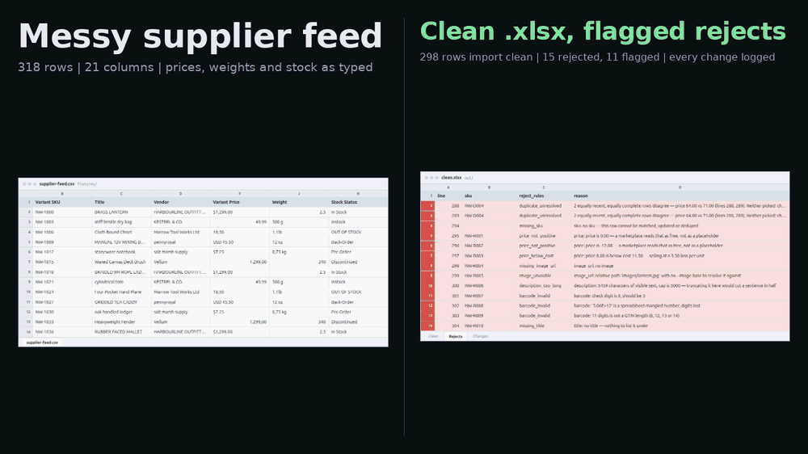

# feed-clean — a product feed that will import, out of one that will not

Point it at the CSV your supplier actually sent. It gives you back a feed that
uploads without an error report, a rejects file naming every row it would not
vouch for, and a line-by-line log of every change it made and the rule that
made it.



It does four things, and it tells you which one it did to every row:

1. **Dedupe** on sku, with a stated rule for which duplicate wins.
2. **Normalise** prices, weights, dimensions, titles, vendor names, booleans
   and stock states into one format and one vocabulary.
3. **Validate** against the rules a marketplace actually bounces rows on.
4. **Report**: `clean.csv`, `rejects.csv`, `changes.csv`, the same three
   tables as one `clean.xlsx` workbook, and a one-screen summary.

```
feed-clean · fixtures/supplier-feed.csv
profile   · Northwind Trading Co. weekly export (bundled fixture)

  318 rows in  ->  298 clean  ·  15 rejected  ·  11 kept but flagged

DEDUPE    6 sku(s) arrived more than once (12 rows involved, 5 dropped)
      newest updated_at                   2   won
      identical                           1   won
      more complete                       2   won
      unresolved tie                      1   -> every row in the group rejected
      3 empty field(s) backfilled from a dropped row
NORMALIZE 2564 value(s) rewritten across 318 row(s)
      description.html                  318
      stock_status.vocabulary           317
      weight.unit                       316
      dimensions.unit                   316
      ... and 8 more rule(s)           1297
      13 value(s) could not be resolved; left empty, original kept in changes.csv
REJECT    15 row(s), not in the clean feed
      barcode_invalid                     3
      duplicate_unresolved                2
      price_not_positive                  2
      price.format                        2
      ... and 6 more rule(s)              6
FLAG      11 row(s) in the clean feed, marked needs_review
      weight.unit                         2
      dimensions.unit                     2
      stock_status.vocabulary             1
      published.vocabulary                1
      ... and 5 more rule(s)              5
COLUMNS   20 supplier header(s) mapped
      1 carried through unmapped: Supplier Ref
      2 vendor(s) not in the alias map: Tidepool Goods, Zephyr Works

  out/clean.csv          298 rows
  out/rejects.csv         15 rows
  out/changes.csv       2592 rows
  out/clean.xlsx        2905 rows
```

## The one rule everything else follows

**Nothing is silently corrected, and nothing is guessed.**

Every value that changed has a line in `changes.csv` saying what it was, what
it is now, and which rule did it. Every value the tool could not work out is
left **empty**, flagged, and reported with the original quoted back at you. It
is never filled in with something plausible.

That sounds fussy until the alternative happens to you. A feed cleaner that
reads `Weight: 1.2` with no unit column and decides it means kilograms ships
two hundred parcels at the wrong postage, and the first you hear about it is
the carrier invoice five weeks later. `1.2` is not a weight. It is a number
next to an empty unit column, and the only honest thing to do with it is say
so.

## Install and run

Needs `make`, `curl` and a 64-bit Linux or macOS. That is the whole list. It
does **not** need you to have Python 3.12, `pip` or `uv` set up first, and the
tool itself has **no dependencies at all** — everything it does is `csv`, `re`,
`decimal` and `html` from the standard library.

```bash
git clone <this repo> && cd feed-clean
make run
```

**About 9 seconds** from a dead clone to real output — 8.8, 9.5 and 10.2 s over
three clones, measured with an empty `HOME` and `PATH=/usr/bin:/bin`: no `uv`,
no virtualenv, no caches, nothing on the machine. Most of that is fetching a
pinned `uv` and one wheel, so it moves with your connection. On a machine with
no Python 3.12 at all, uv downloads an interpreter too and it is closer to a
minute.

```bash
make test           # the same 304 tests: 51s in that clone, 56s from a cold one
make strict         # the same run, but exit 2 if any row was rejected
make demo           # regenerate the clip above, headless
make demo-terminal  # the same story recorded as a terminal session instead
```

Only two of those touch `out/`: **`make run`** and **`make strict`** overwrite
the four files they write, and **`make demo`** deletes the directory before
recording, because a clip that opens on output from an earlier run is a lie
about what the first command does. `make test` and `make fixtures` do not read
or write it at all, so you can run the tests over a result you are still
looking at. `make clean` removes `out/` along with the venv and the fetched
toolchain, and it says so in its name.

`make demo` is the slow one, because it renders a real browser and has to
download a headless Chromium to do it. Measured on this machine: **28 seconds**
to re-record once the toolchain is there, and the first run adds a ~170 MB
browser download on top of that — call it a minute and a half on a warm
connection. It leaves **784 MB** in `demo/.toolchain/`, all of it inside the
repo and none of it installed system-wide. `make clean` removes it.

If you would rather use your own tooling:

```bash
uv venv && uv pip install -e '.[dev]'            # or:
python3 -m venv .venv && .venv/bin/pip install -e '.[dev]'

.venv/bin/python clean.py fixtures/supplier-feed.csv --report
```

That last line is the whole tool. Everything above it is just getting a Python
that can run it.

## Which duplicate wins, and why

"First seen wins" is the rule everybody implements and nobody can defend: the
winner is decided by the order the supplier happened to write the file in,
which is to say by nothing. This is the ladder instead, and the reason for each
rung is that it matches what a duplicate usually *is*:

| | Rule | Because |
| --- | --- | --- |
| 1 | **Identical rows collapse.** | Same sku, same everything: the supplier exported the same product twice. There is no decision to make. |
| 2 | **Newest `updated_at` wins.** | Two *different* rows for one sku is nearly always an old row and a resend. The resend is the supplier's latest answer. |
| 3 | **Then the more complete row wins.** | No usable timestamps, or the same timestamp on both. A row with a price and an image beats a row with neither: same product, described better. |
| 4 | **Then the row with more populated columns.** | A tiebreak that is at least about the data rather than about file order. |
| 5 | **Otherwise it is a tie, and a tie is not resolved.** | Two rows, equally fresh, equally complete, disagreeing about the price. Keeping either one is a coin flip with your margin, so **both are rejected** and the reason names the columns they disagree on. |

Dates are only read in ISO 8601 form. `03/04/2026` is the 3rd of April to your
supplier and the 4th of March to your marketplace, and nothing in the file says
which — so an ambiguous date counts as **no date** and the group drops to rung
3, which is a decision that does not depend on guessing.

After a winner is chosen, its **empty** descriptive fields are backfilled from
the rows it beat, and each fill is logged with the line it came from:

```
line,sku,field,rule,outcome,before,after,note
291,NW-D005,barcode,dedupe.backfill,changed,,5060007166692,"empty here, taken from dropped line 290"
```

Price, cost and stock level are deliberately **not** backfillable. Carrying a
stale price across from a dropped row is exactly the silent correction this
tool exists not to do. `--no-backfill` turns the whole thing off.

## What it refuses to guess

These are the cells where a feed cleaner earns its keep or quietly wrecks your
catalogue. In every one of them the canonical column is left empty, the row is
marked `needs_review=yes`, and the `issues` column quotes what the cell
actually said:

```
sku,...,weight_g,...,needs_review,issues
NW-F001,...,,...,yes,weight_g: no unit on '1.2' and no weight unit column
```

| The cell says | What a guessing tool does | What this does |
| --- | --- | --- |
| `Weight: 1.2`, no unit anywhere | Calls it kilograms | `no unit on '1.2' and no weight unit column` |
| `3 stone` | Calls it 3 | `unknown weight unit 'stone'` |
| `12 x 8` | Assumes depth 0 | `expected L x W x H` |
| `30cm x 20in x 10cm` | Picks a unit | `mixed units ['cm', 'in']` |
| `Price: $60.00 $48.00` | Takes the second one | `more than one number` |
| `Price: Call for quote` | Writes 0.00 | `no number in 'Call for quote'` |
| `Price: €89,00` in a USD feed | Converts it at some rate | Keeps 89.00 **and** EUR, flags the mismatch. An exchange rate invented here is wrong by the time the feed uploads |
| `Barcode: 5.06E+12` | Reformats it as 5060000000000 | `is a spreadsheet-mangled number, digits lost` |
| `Barcode: 06012345678` (11 digits) | Pads the leading zero back | `11 digits is not a GTIN length` — plausible is not the same as known |
| `Stock: Ask in store` | Maps it to out-of-stock | `not a stock state this profile knows. Add it to stock_status in the profile if it is real` |
| Two rows, same sku, same date, £64 and £71 | Keeps the first | Rejects both, naming the prices |

The original is never destroyed. It is in the input file, it is in
`changes.csv` as the `before` value, and it is quoted in the `issues` column.
It just does not get into a column whose header promises grams.

### The row that cannot be fixed

`NW-D004` in the bundled fixture is there on purpose. Two rows, one sku, the
same `updated_at`, the same columns populated, and two different prices. There
is no fact anywhere in that file that picks a winner. So:

```
sku      reject_rules          reason
NW-D004  duplicate_unresolved  2 equally recent, equally complete rows disagree — price 64.00 vs 71.00 (lines 288, 289). Neither picked: choosing would be a guess
NW-D004  duplicate_unresolved  2 equally recent, equally complete rows disagree — price 64.00 vs 71.00 (lines 288, 289). Neither picked: choosing would be a guess
```

Both rows go to `rejects.csv`, the sku is absent from `clean.csv`, and the
reason contains both prices so you can ask the supplier which one is real. That
is a worse-looking result than silently listing it at £64, and a much better
outcome.

## What it normalises

Every rule has an id. The id is what you grep `changes.csv` for and what you
quote at a supplier, and it is stable.

| Rule | Turns | Into |
| --- | --- | --- |
| `price.format`, `cost.format`, `compare_at.format` | `$1,299.00`, `1.299,00`, `1 299,00`, `  18,50  `, `USD 45.50` | `1299.00`, `18.50`, `45.50`, plus a `currency` column |
| `weight.unit` | `2.5` + a `kg` column, `500 g`, `1.1lb`, `12 oz`, `0,75 kg` | `weight_g`: `2500`, `500`, `499`, `340.2`, `750` |
| `dimensions.unit` | `12 x 8 x 4 in`, `300mm x 200mm x 100mm`, `30 × 20 × 10 cm` | `length_mm`, `width_mm`, `height_mm` |
| `title.case` | `BRASS LANTERN`, `stiff bristle dry bag` | `Brass Lantern`, `Stiff Bristle Dry Bag` |
| `vendor.canonical` | `HARBOURLINE OUTFITTERS`, `Harbourline`, `harbourline outfitters inc` | `Harbourline Outfitters` |
| `stock_status.vocabulary` | `In Stock`, `instock`, `OUT OF STOCK`, `Back-Order`, `Pre-Order` | `in_stock`, `out_of_stock`, `backorder`, `preorder`, `discontinued` |
| `published.vocabulary`, `taxable.vocabulary` | `TRUE`, `yes`, `1`, `N`, `false` | `true` / `false` |
| `barcode.format` | `506-0000 007916` | `5060000007916`, checksum verified |
| `image_url.scheme` | `//cdn.example.test/a.jpg` | `https://cdn.example.test/a.jpg` |
| `description.html` | `<p>Hard-wearing &amp; simple</p>` | `Hard-wearing & simple` |
| `*.whitespace` | Non-breaking spaces, zero-width spaces, a BOM, doubled spaces | One ordinary space |

Two of those deserve a note.

**Titles are only recased when nobody chose the casing.** An all-caps or
all-lowercase title gets fixed; `pH Test Strips` and `iPhone Cable` are left
exactly as they arrived, because a mixed-case title is somebody's decision.
Measurements stay lowercase (`12mm`, not `12Mm`) and anything in the profile's
`acronyms` list keeps its own spelling (`USB-C`, not `Usb-C`).

**The number grammar is stated, not sniffed.** Both separators present means
the rightmost is the decimal point. One separator with exactly three digits
after it is a thousands separator, so `1,299` and `1.299` both mean 1299 —
correct for a European feed and harmless for a US one, because retail prices do
not have three decimal places. One separator with one or two digits after it is
a decimal point. Anything else is `Unreadable`.

A rule id shows up under `NORMALIZE` in the summary when it resolved a value
and under `FLAG` when it could not. `weight.unit 316` and `weight.unit 2` in
the same report means the unit rule fixed 316 weights and gave up on two.

## What it rejects

A rejected row is **not** in `clean.csv`. Better an import of 298 rows that all
work than 313 rows and an error report you have to reconcile by hand.

| Rule | Rejected because |
| --- | --- |
| `missing_sku` | Nothing to match, update or dedupe on. It is never merged into another product on a name match. |
| `missing_title`, `missing_price`, `missing_image_url` | A required field is empty. Which fields are required is in the profile. |
| `price.format` etc. on a required field | The field was there and unreadable. Reported with the sentence saying what the cell contained, not as "missing". |
| `price_not_positive` | `0.00` or a negative. A marketplace reads zero as free, not as a placeholder. |
| `price_below_cost` | Selling at a loss. Reported with the per-unit number. |
| `image_unusable` | A relative path with no `--image-base` to resolve it against, or a non-http scheme. |
| `description_too_long` | Over the cap, measured on **visible text** after the HTML comes out. Truncating it here would cut a sentence in half, so it is your call, not the tool's. |
| `barcode_invalid` | Bad GTIN check digit, wrong length, non-numeric, or spreadsheet-mangled. |
| `duplicate_unresolved` | The tie above. |

And the ones that keep the row but mark it `needs_review`: every unresolvable
value in the table further up, plus `compare_at_not_above_price` (a
strike-through that would show a fake discount), `stock_inconsistent` (in stock
with zero on hand, or out of stock with nine), and `title_too_long`.

Exit codes: `0` fine, `1` with `--fail-on-review` if anything is flagged, `2`
with `--fail-on-reject` if anything was rejected, `3` a usage or profile
problem, `4` the input could not be read.

## The files it writes

**`out/clean.csv`** — the feed you upload. Canonical names, one unit per
column, the unit in the header:

```
sku,title,vendor,product_type,price,currency,cost,compare_at,barcode,weight_g,
length_mm,width_mm,height_mm,quantity,stock_status,published,taxable,image_url,
description,tags,handle,updated_at,<your unmapped columns>,needs_review,issues
```

**`out/rejects.csv`** — what you send back to the supplier. `line`, `sku`,
`reject_rules`, `reason`, and then **their original row, untouched, under their
own headers**. They open it, read the sentence, fix the cell in front of them
and resend. A rejects file that shows your canonical version of their row makes
them do the translation twice.

**`out/changes.csv`** — every edit, forever. This is the answer to "what did
your tool do to my data":

```
line,sku,field,rule,outcome,before,after,note
2,NW-1000,price,price.format,changed,"$1,299.00",1299.00,
2,NW-1000,title,title.case,changed,BRASS LANTERN,Brass Lantern,
2,NW-1000,vendor,vendor.canonical,changed,HARBOURLINE OUTFITTERS,Harbourline Outfitters,
2,NW-1000,weight_g,weight.unit,changed,2.5 kg,2500,
283,NW-D001,sku,dedupe.keep,changed,NW-D001,NW-D001,"2 rows for this sku; kept this one (newest updated_at), dropped line(s) 282"
282,NW-D001,sku,dedupe.drop,dropped,NW-D001,,kept line 283 instead (newest updated_at)
307,NW-F001,weight_g,weight.unit,unresolved,1.2,,no unit on '1.2' and no weight unit column
```

`outcome` is `changed`, `unresolved` or `dropped`. An `unresolved` row always
has an empty `after` and a non-empty `note` — that is the shape of a refusal.
`line` is the line number in **your** file, so it matches what your spreadsheet
says.

**`out/summary.txt`** — the screen at the top of this README. `--report` prints
it; `--brief` prints the eight-line version, which is what you want in a cron
log.

**`out/clean.xlsx`** — the same three tables as one workbook, because clients
ask for Excel and not for CSV. Three sheets in the order you want them: **Clean**
first, because that is the file you opened the workbook for, then **Rejects**,
then **Changes**. Header row frozen and filterable, prices stored as numbers you
can sum rather than as text, skus and barcodes kept as text so Excel cannot eat
a leading zero, and every flagged or rejected row tinted.

It is the one part of the output with a dependency — `openpyxl` — so it is
**optional**. Without it you get the three CSVs and a line **on stderr** saying
the workbook was skipped and why — not in `out/summary.txt`, so a cron job that
only keeps stdout will not see it — which is a complete result, not a failure.
`make run` and `make test` install it; a bare `pip install .` does not, and
`pip install 'feed-clean[xlsx]'` adds it. `--no-xlsx` skips the workbook even
when openpyxl is there, and says nothing about it — there you asked for it.

The CSVs and the sheets are two renderings of one definition in `report.py`, not
two pieces of code that have to be kept agreeing — so `clean.csv` and the Clean
sheet cannot disagree about a column or a value.

## Pointing it at your own feed

One JSON file, no code. `profiles/supplier.json`, abridged — the real one
carries more aliases per column and a longer `acronyms` list:

```json
{
  "name": "Northwind Trading Co. weekly export (bundled fixture)",
  "currency": "USD",
  "columns": {
    "sku":   ["Variant SKU", "SKU", "Item Number"],
    "price": ["Variant Price", "Price", "Retail Price", "RRP"],
    "weight": ["Weight", "Variant Weight", "Shipping Weight"]
  },
  "vendors": {
    "Harbourline Outfitters": ["harbourline", "harbourline outfitters inc"]
  },
  "stock_status": {
    "in_stock": ["in stock", "instock", "available", "yes"],
    "backorder": ["back order", "backorder", "on backorder"]
  },
  "booleans": { "true": ["true", "yes", "y", "1"], "false": ["false", "no", "n", "0"] },
  "acronyms": ["USB-C", "LED", "IP67"],
  "required": ["sku", "title", "price", "image_url"],
  "limits": { "description_max": 5000, "title_max": 150 }
}
```

Header matching ignores case, spacing and punctuation, so `Variant SKU`,
`variant sku` and `VARIANT_SKU` all land on `sku`. Aliases are matched the same
way, which is why the vendor list only needs the spellings that are genuinely
different rather than every capitalisation of each one.

The profile is checked when it **loads**, hard:

- A field name that does not exist is an error listing the ones that do.
- Two fields claiming the same alias is an error naming both, rather than a
  last-one-wins that depends on JSON key order.
- An unknown stock state, an unknown limit, a `required` entry that is not a
  field, a currency that is not a three-letter code: all errors, all before the
  first row is read.

A column with no mapping is **not dropped**. It is carried through to
`clean.csv` under its original header and counted in the summary, because an
unrecognised column is usually the one the client's warehouse sorts on.
Likewise, a vendor that is not in the alias map is case-normalised, carried
through, and listed in the summary so somebody can decide whether it is a new
supplier or a typo — the tool does not decide that `Harbourline` and
`Harbourline Outfitters` are the same company.

## Options

```
clean.py FEED [--profile p.json] [--out DIR] [--image-base URL]
              [--no-backfill] [--report | --brief] [--quiet]
              [--fail-on-review] [--fail-on-reject]
```

| Flag | Effect |
| --- | --- |
| `--profile` | Column aliases and vocabularies. Default `profiles/supplier.json`. |
| `--out` | Where the four files go. Default `out/`. |
| `--image-base` | Base URL for relative image paths. Without it, a relative path is a rejection rather than a guess. |
| `--no-backfill` | Do not fill a winner's empty fields from the duplicates it beat. |
| `--report` | Print the full summary. |
| `--brief` | Print the eight-line version instead. |
| `--fail-on-review` | Exit 1 if any row is flagged. |
| `--fail-on-reject` | Exit 2 if any row is rejected. For a scheduled import that should not upload a partial feed. |

## Sample data

`fixtures/supplier-feed.csv` is **318 rows of an invented supplier's weekly
export**, dirty on purpose. Six vendors that do not exist, selling products that
do not exist, with barcodes computed from made-up numbers. There is no real
supplier, client, product or feed anywhere in this repository or in the
recording.

The dirt is catalogued so you can watch each rule fire:

| In the fixture | Rows | Demonstrates |
| --- | --- | --- |
| Six price spellings: symbol, bare, padded, currency code, and both thousands/decimal conventions (`$1,299.00` and `1.299,00`) | 280 | `price.format` |
| Six weight spellings across four units, half with a separate unit column | 280 | `weight.unit` |
| Four dimension spellings across four units | 280 | `dimensions.unit` |
| All-caps, all-lowercase and correctly-cased titles | 280 | `title.case` |
| Three spellings per vendor, six vendors | 280 | `vendor.canonical` |
| Six stock spellings, five boolean spellings | 280 | the vocabularies |
| Protocol-relative image URLs | 56 | `image_url.scheme` |
| `NW-D001`–`NW-D006` | 12 | every rung of the dedupe ladder, including the unresolvable tie and an ambiguous date |
| `NW-R001`–`NW-R012` and one row with no sku | 13 | every rejection rule |
| `NW-F001`–`NW-F011` | 11 | every review flag |
| `NW-V001`, `NW-V002` | 2 | vendors not in the alias map |
| `Supplier Ref` column | all | a header with no mapping, carried through |

```bash
make fixtures     # regenerate it
```

`fixtures/supplier-feed.csv` and `tests/expected.json` are written by the same
function call in `fixtures/generate_feed.py`: the dirty cell and the value it
should clean up to sit next to each other in the source. So the end-to-end
tests assert against what the fixture *means*, not against what the tool
happened to produce the first time it ran. That is the difference between
catching a parser bug and enshrining one — it is how the `$60.00 $48.00`
regression in `test_parse.py` was found.

## Limits, honestly

- **One row per product.** A feed with a parent row and variant rows underneath
  it needs a grouping key, which is a real feature and is not in here. This
  treats every row as a product.
- **Currencies are recorded, never converted.** A mixed-currency feed comes out
  mixed, with the odd rows flagged. Converting would need a rate, a date and a
  decision about rounding, and all three belong to you.
- **It reads what the cell says.** A price shown inclusive of tax in one row and
  exclusive in the next is two different prices as far as this is concerned.
- **The dedupe ladder assumes sku is the identity.** A supplier who reuses skus
  across products, or who ships a feed with no stable identifier, needs a
  different conversation before any tool helps.
- **Descriptions are stripped to plain text** for the length check and for the
  clean feed. If you need the supplier's HTML preserved for a rich description
  field, that is a small change, but it is a change.
- **No image fetching.** It checks that an image URL is an absolute http(s)
  URL. It does not check that the image exists, is the right size, or is not a
  placeholder.
- Tested against the bundled fixture and 304 tests. On a real feed the
  honest expectation is that most rows come out clean and the rest get flagged
  or rejected rather than silently wrong. That is what the flag is for.

## Tests

```bash
make test          # or: .venv/bin/python -m pytest -q
```

304 tests, no network, about 49 seconds. Roughly half of that is the
`test_make_targets.py` row of the table below: nine tests that run `make` in a
throwaway copy of the repo, because the bug they cover only exists at that
level. Those nine take 23 seconds; the other 295 take 26.

| File | Covers |
| --- | --- |
| `test_parse.py` | The parsers on strings: money, weights, dimensions, GTINs, URLs, title casing. Most of the suite, because this is where a feed cleaner is either trustworthy or quietly wrong. |
| `test_profile.py` | Profiles failing at load time with a message that says what to fix. |
| `test_normalize.py` | Header mapping, and that every edit leaves a change and every refusal leaves a change *and* an issue. |
| `test_dedupe.py` | The ladder, one rung at a time, including that a tie rejects the group and that price is never backfilled. |
| `test_validate.py` | Every reject and review rule, and the line between them. |
| `test_report.py` | The shape of the output tables and the wording of the summary. |
| `test_workbook.py` | `clean.xlsx`: that each sheet matches the CSV beside it row for row, that money is a number and a sku is not, and that a machine without `openpyxl` gets a line rather than a crash. |
| `test_cli.py` | End to end over the bundled feed, asserting against `tests/expected.json`. |
| `test_demo_preview.py`, `test_demo_fetch.py` | The shared recording helpers in `demo/lib/`: the table renderer and the download retry ladder. |
| `test_demo_sheet.py` | The shared spreadsheet renderer in `demo/lib/sheet.py`, which draws the clip's BEFORE and AFTER frames: that it refuses to render a file that is not on disk, that a filtered view keeps the source file's own column letters and row numbers, and that the command on screen is the one whose output is under it. |
| `test_demo_outputs.py` | That the recording writes both the GIF and the MP4, including the case where `vhs` exits `0` having skipped one of them. |
| `test_make_targets.py` | Which `make` targets may touch `out/`. `make run` writes it; `test`, `strict` and `fixtures` must leave whatever is there alone; only the recording asks `setup.sh` to delete it. |

## Recording the demo

`./demo/record.sh` regenerates the clip at the top of this file from scratch,
headless, on the synthetic fixture. It is a reusable pipeline with two recipes,
documented in [demo/README.md](demo/README.md). This piece uses the browser one,
because the clip ends on `out/clean.xlsx` open in a spreadsheet grid and only a
browser renders one. The terminal telling is still here:
`make demo-terminal` writes it to `demo/out-terminal/`.

**The AFTER frame is the real file.** The scene runs `clean.py`, then opens the
workbook that run wrote and reads it off disk. It is not a fixture, not a
re-typed table, and not a CSV pretty-printed into something spreadsheet-shaped —
if the run does not write the file, the recording fails instead of showing you
one.

## Layout

```
clean.py                     CLI entry point
feed_clean/
  parse.py                   text in, values out. Pure, and where most of the tests are.
  profile.py                 the feed profile, loaded and validated
  normalize.py               raw row in, canonical row out, every edit logged
  dedupe.py                  the ladder, and the backfill
  validate.py                the reject and review rules
  report.py                  the output tables, the CSV and xlsx writers, the summary
  models.py                  Row, Change, Issue
  cli.py                     arguments, the pipeline, exit codes
profiles/supplier.json       column aliases and vocabularies for the fixture
fixtures/generate_feed.py    writes the dirty feed and its ground truth together
fixtures/supplier-feed.csv   318 synthetic rows, dirty on purpose
demo/                        the headless recording pipeline
```
